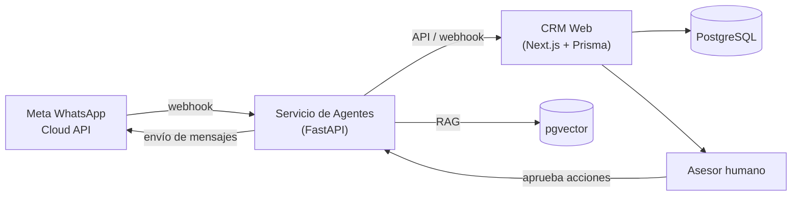

# Arquitectura

## Principios

- **Desacoplamiento total** entre el CRM y el motor de IA: se comunican solo por
  API/webhooks, nunca comparten código ni proceso. Permite escalar o redeployar
  uno sin tocar el otro.
- **Human-in-the-loop en v1.0**: los agentes pueden leer, clasificar y proponer
  respuestas, pero cualquier acción destructiva (borrar/editar datos críticos,
  envío masivo) requiere aprobación humana explícita.
- **Self-hosted** (Docker + EasyPanel) en vez de serverless, para soportar cron
  jobs de seguimiento y conexiones persistentes (SSE) sin las limitaciones de
  plataformas tipo Vercel.

## Diagrama de flujo

## Componentes

### CRM Web (Next.js)
- Pipeline de leads tipo Kanban (Consulta → Documentación → Aplicación → Visa → Matrícula).
- Ficha de estudiante: datos de contacto, historial de conversación (resumen generado por IA), documentos, tareas.
- Dashboard de métricas (leads por etapa, tiempo de respuesta, conversión).
- Expone API interna que el servicio de agentes consume (crear/actualizar lead, registrar interacción, consultar estado).

### Servicio de Agentes ("Hermes", Python/FastAPI)
- Recibe webhooks de WhatsApp Cloud API (mensajes entrantes, estados de entrega).
- Pipeline de agentes:
  1. **Clasificador de intención** — consulta general, quiere aplicar, pregunta de visado, quiere hablar con un humano.
  2. **Lead scoring** — prioridad según país de interés, urgencia, señales de la conversación.
  3. **Respuesta con RAG** — responde usando la base de conocimiento de programas/universidades (pgvector).
  4. **Escalado a humano** — cuando la confianza es baja o el usuario lo pide.
- Cola de aprobación humana para acciones sensibles antes de ejecutarlas.

### Base de datos
- PostgreSQL como fuente de verdad del CRM (Prisma como ORM).
- pgvector para embeddings de la base de conocimiento (RAG).

## Seguridad y datos

- Sin datos reales de estudiantes ni convenios: entorno de desarrollo con datos ficticios/sintéticos.
- Tokens de Meta y credenciales solo en variables de entorno, nunca en el repo.
- Antes de implementar cada módulo nuevo: pasar por debate multiagente tipo "Predict" (Product/Backend/UX/Seguridad) y auditoría Red Team, siguiendo la metodología de los Workshops 4 y 8.
