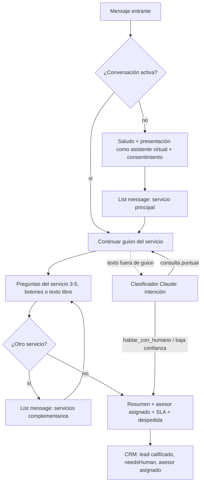

# Análisis: flujo guiado de WhatsApp con plantillas, Zernio y whatsapp-closer-agentkit

> Evaluación de la propuesta del equipo (2026-09-09) y versión mejorada ajustada a
> este proyecto. Documento de decisión: lo que está marcado como **decisión abierta**
> lo debe cerrar el equipo comercial.

## 1. Resumen ejecutivo

- **La propuesta es correcta en lo esencial** — un flujo guiado por botones es más
  fiable, más barato y más medible que dejar que el modelo improvise. Encaja con lo
  ya construido: el CRM y el servicio de agentes se conservan; lo que cambia es que
  el agente pasa de "clasificar y contestar" a "conducir un guion y calificar".
- **Cuatro mejoras necesarias** antes de implementarla: (1) el bot debe presentarse
  como asistente virtual, no como el asesor; (2) el menú de servicios debe ser un
  *list message*, porque WhatsApp limita los botones a 3; (3) "2 o más servicios" se
  resuelve con un bucle "¿necesitas otro servicio?", no con selección múltiple;
  (4) hace falta una línea de consentimiento RGPD al inicio.
- **whatsapp-closer-agentkit**: no se instala ni se integra — es un blueprint. Se
  toman cuatro patrones (adaptador de proveedor, modo borrador, contratos JSON de
  salida, transcripción de audios) y se descarta el resto (Supabase, Calendar,
  Railway, Slack).
- **Zernio**: se recomienda adoptarlo **detrás de una interfaz de proveedor**, no
  como reemplazo directo. Aporta plantillas gestionadas, ventana de 24 h y canales
  extra (Instagram/Messenger), pero es un proveedor más con coste y dependencia.
  La Cloud API directa, que ya funciona, queda como implementación de referencia
  y respaldo. **Decisión abierta:** precio y plan de Zernio.

## 2. whatsapp-closer-agentkit — qué tomar y qué no

El kit (MIT) es un conjunto de skills de Claude Code que *construyen* un agente
Python/FastAPI en seis pasos: recepción (con transcripción de audio), calificación,
respuesta con playbook de objeciones, agendamiento, registro en CRM y escalación
humana. Soporta Meta Cloud API, Zernio y un modo demo con entregas grabadas.

| Patrón del kit | Veredicto | Cómo aplica aquí |
|---|---|---|
| Adaptador de proveedor (`WHATSAPP_PROVIDER` = meta / zernio / demo) | **Tomar** | Extraer `WhatsAppClient` a una interfaz `MessagingProvider` con dos implementaciones (Meta, Zernio). El modo demo ya existe en forma de `send_test_message.py`. |
| Modo borrador: el humano confirma antes de enviar | **Tomar parcialmente** | No para cada mensaje del guion (mataría la velocidad), sí para envíos iniciados por la empresa (plantillas de reenganche) y para respuestas libres del modelo fuera de guion. Coincide con el human-in-the-loop de la v1.0. |
| Contratos JSON Schema con `additionalProperties: false` | **Ya lo tenemos** | Es lo que hace `messages.parse` + Pydantic en `classifier.py`. |
| Transcripción de audios (Whisper) | **Tomar, prioridad alta** | Los estudiantes LATAM envían muchos audios; hoy los ignoramos. Se puede resolver sin OpenAI (ver §7). |
| Playbook de objeciones | **Tomar la idea, no el contenido** | El equivalente aquí son las "preguntas por servicio" y las respuestas a preguntas frecuentes por servicio, escritas por el equipo comercial. |
| Compuerta de 23 chequeos (`auditar.py`) | **No ahora** | Buena idea para la fase Red Team del roadmap; no bloquea. |
| Supabase como CRM, Google Calendar, Railway, Slack | **Descartar** | Ya tenemos CRM propio, EasyPanel y la asignación de asesores vive en el CRM. Agendar cita con el asesor es una fase posterior. |

**Conclusión:** el kit confirma la arquitectura elegida (FastAPI + proveedor de
WhatsApp + Claude con salida estructurada + CRM) y aporta patrones, no código.

## 3. Zernio frente a Meta Cloud API directa

| Criterio | Meta Cloud API directa (actual) | Zernio |
|---|---|---|
| Coste | Solo conversaciones de Meta (nivel gratuito para el volumen actual) | Suscripción de Zernio **+** conversaciones de Meta. **Decisión abierta.** |
| Plantillas | Crear y aprobar a mano en Meta Business Manager | Gestiona envío a aprobación y categorías |
| Ventana de 24 h y rate limits | Hay que modelarlos en nuestro código | Los gestiona la pasarela |
| Botones, listas, Flows | Soportado (ya documentado en `02-whatsapp-cloud-api.md`) | Soportado, misma superficie de la Cloud API |
| Otros canales | Solo WhatsApp | Instagram, Messenger, Telegram, X con un único webhook |
| Builder visual | No | Sí (útil para que el equipo comercial ajuste guiones sin desplegar) |
| Dependencia | Solo Meta | Meta + un intermediario (si cae o cambia precios, afecta) |
| Cambio en nuestro código | Ninguno | Firma `X-Zernio-Signature`, formato de webhook y de envío distintos |

**Recomendación:** implementar el flujo sobre la interfaz `MessagingProvider`. Meta
directa es la implementación de referencia (ya probada). Zernio se añade como
segunda implementación y se activa por configuración cuando el equipo confirme
plan y precio; el mismo guion corre sobre ambas. Si el equipo valora los canales
extra (Instagram es fuerte en el público 18-35), Zernio pasa a ser el proveedor
por defecto en la fase de integración con ISP.

## 4. Flujo propuesto (versión mejorada)

### Guion por paso (con las mejoras)

| # | Propuesta original | Versión mejorada | Por qué |
|---|---|---|---|
| 1 | "Hola ####" | "Hola {nombre}" usando el nombre del perfil de WhatsApp; si viene vacío o es un apodo/emoji, "Hola, ¿cómo te llamas?" como primera pregunta | El `profile.name` de WhatsApp no siempre es un nombre. |
| 2 | "Soy ###, tu asesor de Tu Red en España…" | "Soy el **asistente virtual** de Tu Red en España. Te haré unas preguntas rápidas para que **{asesor}**, tu asesor, te contacte con todo listo. Al continuar aceptas nuestra política de privacidad: {enlace}." | (a) Transparencia: el usuario debe saber que habla con un sistema automático — obligación del Reglamento de IA de la UE (art. 50) y práctica de Meta; además evita la decepción cuando entra el humano. (b) RGPD: tratamos datos personales de residentes en la UE; consentimiento y aviso al inicio. (c) El asesor se asigna por servicio, así que su nombre se menciona una vez elegido el servicio (o se usa "tu asesor" hasta entonces). |
| 3 | Botones con los servicios | **List message** (hasta 10 filas) con los 6-7 servicios; los botones se reservan para respuestas de 2-3 opciones dentro de cada servicio | La Cloud API limita los botones de respuesta a **3 por mensaje** (título ≤ 20 caracteres). |
| 3b | "si son 2 o más servicios" | Tras terminar las preguntas de un servicio: botones **"Sí, otro servicio" / "No, eso es todo"**; si sí, list message con los servicios complementarios de ese servicio (cross-sell) | Ni botones ni listas admiten selección múltiple. La alternativa nativa son **WhatsApp Flows** (formularios con casillas), más potentes pero con más trabajo; se dejan para una fase posterior. |
| 3c | Preguntas por servicio | Definidas como **datos** (YAML), 3-5 por servicio, con tipo de respuesta y validación; el equipo comercial las edita sin tocar código | Ver §5. |
| 4 | Despedida | Resumen de lo recogido + "{asesor} te escribirá por este WhatsApp en menos de **24 h**" + despedida | El SLA de primer contacto de ISP es 24 h; decirlo fija expectativas y es medible. |

**Mensajes fuera de guion:** si el estudiante escribe texto libre en vez de tocar
un botón, el clasificador actual decide: `hablar_con_humano` o confianza baja →
cierre y aviso al asesor; consulta puntual → respuesta breve y se retoma el paso.
Los audios se transcriben antes de clasificar (§7).

**Reenganche:** si el estudiante abandona a mitad del guion, a las 24 h ya no se
puede escribir libremente; hace falta una **plantilla aprobada** (categoría
*utility*): "Hola {nombre}, quedó pendiente tu consulta sobre {servicio}. ¿Seguimos?"
con botones. Es el único envío iniciado por la empresa del flujo y el que más se
beneficia de Zernio.

## 5. Catálogo de servicios y preguntas (revisado el 2026-09-09)

**Decisión del equipo:** las preguntas de WhatsApp son **las mismas de los formularios
web de cada servicio** — una sola definición para los dos canales, así el asesor lee
lo mismo venga de donde venga y ninguna pregunta se redacta dos veces. Los cinco
servicios y sus campos:

| Servicio (fila del list message) | Preguntas (del formulario web) | Complementarios |
|---|---|---|
| Aún no sabes qué estudiar (asesoría académica) | Nivel de estudios (lista) · ¿Experiencia laboral demostrable? (Sí/No) · Ciudad donde quieres estudiar (lista) · ¿Algo más que debamos saber? | Seguro, Alojamiento, Jurídica |
| Seguro médico | Rango de edad (lista) · ¿Algo más? | Alojamiento, Jurídica |
| Alojamiento | ¿Cuántas personas sois? (1 / 2 / 3 o más) · ¿Mascota? (Sí/No) · Ciudad (lista) · ¿Algo más? | Seguro, Jurídica |
| Asesoría jurídica | Trámite (lista: visado de estudios, NIE/TIE, renovación, reagrupación, homologación, otro) · ¿Algo más? | Seguro |
| Inserción laboral | Nivel de estudios (lista) · ¿Algo más? | Jurídica, Alojamiento |

**Pregunta común, una sola vez por conversación** (viene del formulario académico,
pero es la que más valor tiene para todos): *¿En qué punto estás?* → "Aún no he
viajado" (→ fecha estimada de viaje en rangos) / "Ya estoy en España" (→ desde
cuándo: menos de 30 días / 1-3 meses / más de 3 meses). En WhatsApp se pregunta con
botones de rango, no con fecha exacta; el CRM guarda el rango (el formulario web
guarda la fecha).

**Regla de la llamada:** si está en España **desde hace menos de 30 días**, el
asistente ofrece **agendar una llamada de 15-20 minutos** con el asesor del
servicio, porque en ese momento casi siempre buscan programa académico y estancia
por estudios. Se muestran huecos de los próximos 3 días hábiles (list message, 9
filas), se reserva el bloque en el calendario del asesor, se confirma por WhatsApp y
el guion continúa para que el asesor llegue con datos. La despedida cambia: en vez
de "te escribirá en 24 h", recuerda la cita y programa una plantilla de recordatorio
(*utility*) para dos horas antes. Requisito técnico nuevo: **calendario del asesor**
(Google Calendar o Cal.com vía API; decisión abierta).

**Lenguaje de cuidado por servicio.** Al elegir servicio, el asistente dice qué hace
y qué no hace, con la misma lógica de destinatarios de la política de privacidad:
- Jurídica: *"Tu caso lo revisa un despacho colaborador. Por este canal no podemos
  darte indicaciones legales ni plazos."* Si el estudiante hace una pregunta legal
  en texto libre, el clasificador la marca como `consulta_legal` y el asistente
  **no responde el fondo**: lo anota para el despacho.
- Seguro: no se confirman coberturas ni condiciones por WhatsApp.
- Inserción laboral: no se garantiza una oferta; se pasa el contacto a agencias.
- Académica: la admisión la decide cada centro.

**Consentimiento:** el segundo mensaje usa el **mismo literal y versión** (v1.0)
que la casilla del formulario web, y el CRM registra texto, versión y marca de
tiempo — igual que la web. Los textos legales de ISP siguen marcados como borrador
pendiente de revisión por un abogado; el asistente hereda esa pendencia.

Reglas de diseño de las preguntas:
- **Minimización de datos (RGPD):** no pedir pasaporte, NIE ni documentos por
  WhatsApp; eso lo hace el asesor por el canal seguro de ISP.
- Cada respuesta se guarda como par `pregunta → respuesta` en el lead, y el resumen
  final se genera desde ahí (sin modelo, determinista).

## 6. Calificación y entrega al asesor

- **Calificación por reglas, no por modelo:** guion completado = lead calificable;
  los campos respondidos alimentan una puntuación 0-100 (p. ej. carta de admisión
  "Sí" y viaje en < 3 meses puntúan alto). Es explicable ante el asesor y coincide
  con el *scoring* previsto en ISP.
- **El modelo clasifica, el humano decide:** el bot deja el lead en estado
  *Consulta* con `needsHuman`, los datos del guion y el asesor sugerido (por tipo
  de servicio, reparto equitativo). El paso a *Contactado* y a *Calificado* lo da
  el asesor — igual que en el ciclo de vida de leads de ISP, donde ambas
  transiciones son humanas.
- **Aviso al asesor:** por ahora la insignia "Necesita asesor" en el CRM; en fase
  siguiente, notificación por correo (SMTP ya previsto) o WhatsApp interno.
- **Dedupe:** un mismo teléfono con conversación activa no crea un lead nuevo; si
  vuelve tras cerrar, se reabre el mismo lead (ya funciona así por `phone`).

## 7. Cambios técnicos necesarios (roadmap ajustado)

| Versión | Cambio | Notas |
|---|---|---|
| `0.6.0` | **Estado de conversación** en el CRM (`Conversation`: paso actual, servicio, respuestas) y **motor de guion** en `agent-service` que lee flujos desde YAML | Hoy el agente es sin estado; es el cambio estructural principal. |
| `0.6.0` | **Mensajes interactivos** en `WhatsAppClient`: `send_buttons`, `send_list`; parseo de respuestas `interactive` (`button_reply` / `list_reply`) en el webhook | Hoy solo texto. |
| `0.6.0` | **Interfaz `MessagingProvider`** con Meta como implementación; Zernio como segunda implementación cuando haya cuenta | Patrón del agentkit. |
| `0.7.0` | **Audios:** transcripción antes de clasificar. Opción sin OpenAI: descargar el media de Meta y transcribir con un modelo local (`faster-whisper`) en el contenedor Python, o enviar el audio a Claude cuando la API lo soporte para el modelo elegido. **Decisión abierta.** | Hoy se ignoran. |
| `0.7.0` | **Plantilla de reenganche** aprobada en Meta (o vía Zernio) + job programado que la envía a conversaciones abandonadas > 24 h, con confirmación humana (modo borrador) | Único envío iniciado por la empresa. |
| `0.8.0` | Notificación al asesor asignado y panel de "bandeja" en el CRM para revisar borradores | — |
| Posterior | WhatsApp Flows para selección múltiple y formularios; RAG sobre guías de ISP para las consultas fuera de guion | RAG baja de prioridad: con guion, el modelo habla menos. |

## 8. Riesgos y decisiones abiertas para el equipo

1. **Precio y plan de Zernio** frente a operar Meta directa. Sin ese dato no se
   puede cerrar la decisión de proveedor.
2. **Nombre del asesor en el saludo:** ¿fijo por servicio, por ciudad, o reparto
   equitativo? Define la regla de asignación.
3. **Texto legal de consentimiento y enlace a la política de privacidad** de Tu Red
   en España para el mensaje 2.
4. **Validar preguntas por servicio (§5)** con el equipo comercial: son un borrador
   a partir del catálogo de servicios, no de la operación real.
5. **Audios:** ¿se transcriben (coste/latencia) o se responde "¿me lo escribes?"
   en la primera versión?
6. **Horario:** ¿el bot responde 24/7 y el asesor en horario laboral? El mensaje
   de despedida debe reflejarlo ("te escribirá el próximo día hábil").

---

Fuentes consultadas: repositorio `Hainrixz/whatsapp-closer-agentkit` (README, MIT),
documentación pública de Zernio (WhatsApp API, plataformas e integraciones),
documentación de Meta WhatsApp Cloud API (mensajes interactivos, ventana de 24 h,
plantillas) y, de ISP, únicamente el catálogo de tipos de servicio y el ciclo de vida
del lead.
